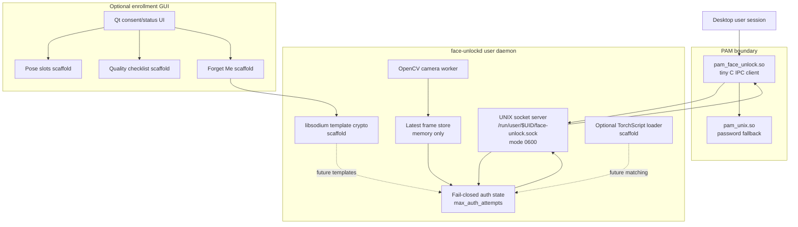
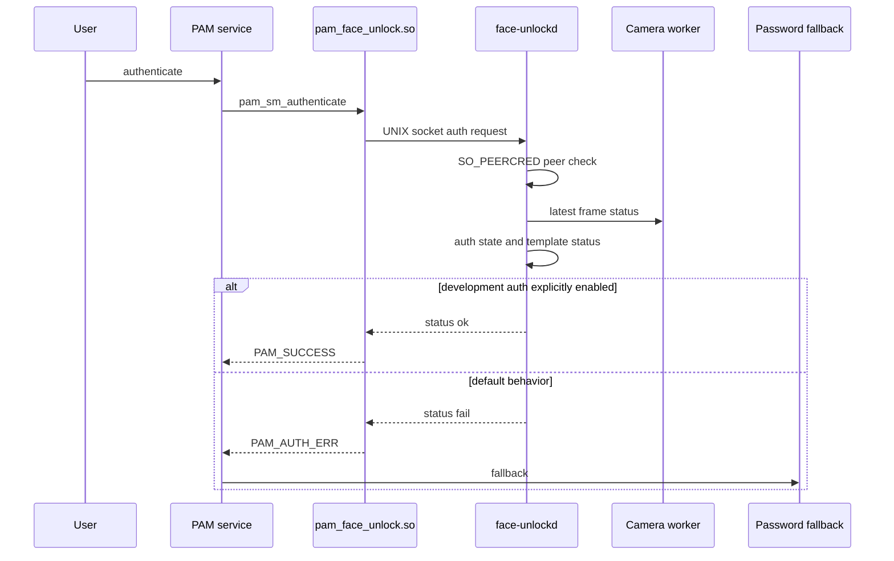

# face-unlock-linux

Experimental, safety-first face unlock infrastructure for Ubuntu Linux.

face-unlock-linux is building a local, user-controlled face unlock system for Ubuntu 24.04 using a user daemon, UNIX socket IPC, a minimal PAM bridge, OpenCV, encrypted template storage scaffolding, Qt GUI scaffolding, and optional TorchScript model loading.

This project is currently an alpha infrastructure prototype.

It is not real biometric authentication yet.

## Why this project exists

Authentication projects are risky when heavy camera/model code runs inside PAM or when installers modify system authentication files too early.

This project is built around the opposite approach:

- keep PAM tiny and auditable
- run camera/model work in a normal user daemon
- use local-only UNIX socket IPC
- check socket peer credentials
- fail closed by default
- keep password fallback available
- encrypt template data at rest
- never store biometric data silently
- require explicit consent for risky actions
- document rollback before integration

## Current status

| Area | Status |
|---|---|
| Target OS | Ubuntu 24.04 LTS |
| Release | v0.1.0-alpha infrastructure prototype |
| Daemon | Working C++17 prototype |
| Camera | OpenCV one-shot, loop, and worker thread |
| IPC | UNIX socket with 0600 permissions |
| Peer checks | SO_PEERCRED logging and policy |
| PAM | Minimal C IPC module |
| PAM testing | Fake PAM service and guarded sudo test flow |
| Auth default | Fail-closed |
| Dev auth | Explicit FACE_UNLOCK_DEV_ALLOW=1 only |
| Templates | libsodium encrypted placeholder scaffold |
| Enrollment | Manifest scaffold only |
| GUI | Optional Qt consent/status scaffold |
| Models | TorchScript export/load scaffolds |
| Packaging | CPack Debian package skeleton |
| Real face recognition | Not implemented yet |
| Production lock-screen/login | Not implemented yet |

Detailed status:

    docs/project-status.md
    docs/releases/v0.1.0-alpha.md

## Architecture

Detailed architecture:

    docs/architecture.md

## Authentication flow

## What works today

Developer-safe flows:

- build locally
- run daemon manually
- run daemon as a user service
- test socket IPC
- build PAM module
- test PAM with fake PAM service
- run guarded sudo dry-run and rollback flow
- create/delete encrypted placeholder template
- create/delete placeholder enrollment manifest
- validate manifest JSON
- run crypto self-test
- build Debian package
- run CI
- build optional Qt GUI

## What does not work yet

Not implemented:

- real face detection in daemon
- real face alignment
- real embedding matching
- real biometric enrollment
- secure key management for real templates
- liveness/spoof resistance
- production sudo integration
- lock-screen integration
- GDM/SDDM/LightDM greeter integration
- production-ready Qt enrollment flow

## Quickstart

Install development dependencies:

    ./setup-dev.sh

Build:

    ./scripts/build.sh

Run tests:

    ./scripts/test.sh

Run full local verification:

    ./scripts/verify-local.sh

Run daemon camera probe:

    ./build/daemon/face-unlockd --camera 0

Run daemon mode:

    ./build/daemon/face-unlockd --camera 0 --daemon

In another terminal:

    ./scripts/test-socket-client.sh ping
    ./scripts/test-socket-client.sh camera_status
    ./scripts/test-socket-client.sh auth

Default auth should fail closed.

## Development-only auth

Development auth is disabled by default.

Manual dev-only test:

    FACE_UNLOCK_DEV_ALLOW=1 ./build/daemon/face-unlockd --camera 0 --daemon

Then:

    ./scripts/test-socket-client.sh auth

Warning:

    FACE_UNLOCK_DEV_ALLOW=1 must never be used as real authentication.

## PAM and sudo safety

Safe fake PAM test:

    ./scripts/install-fake-pam-test.sh
    pamtester face-unlock-test "$USER" authenticate
    ./scripts/remove-fake-pam-test.sh

sudo dry-run planner:

    ./scripts/plan-sudo-pam-install.sh

guarded sudo apply and rollback:

    ./scripts/apply-sudo-pam-install.sh
    ./scripts/apply-sudo-pam-install.sh --apply
    ./scripts/rollback-sudo-pam.sh --latest

Read before touching sudo:

    docs/pam-safety.md
    docs/pam-fake-service-test.md
    docs/sudo-integration-plan.md
    docs/sudo-safe-installer.md
    docs/sudo-apply-and-rollback.md
    docs/sudo-root-peer-policy.md
    docs/sudo-test-results.md

Do not modify real PAM files unless you understand the rollback path.

## systemd user service

Install user service:

    ./scripts/install-user-service.sh

Check status:

    systemctl --user status face-unlockd.service

Remove:

    ./scripts/remove-user-service.sh

Docs:

    docs/systemd-user-service.md

The user service runs with auth fail-closed by default.

## Template and enrollment scaffold

Create encrypted placeholder template and manifest:

    ./build/daemon/face-unlock-template-tool create-placeholder --i-understand-placeholder

Check status:

    ./build/daemon/face-unlock-template-tool status

Delete:

    ./build/daemon/face-unlock-template-tool delete --yes

Validate manifest:

    scripts/validate-enrollment-manifest.py schemas/enrollment-manifest.example.json

Docs:

    docs/template-storage.md
    docs/template-cli.md
    docs/enrollment-format.md
    docs/manifest-validation.md

## Python prototypes

Capture prototype:

    python3 python/prototype_capture.py --camera 0 --duration-seconds 10

Embedding prototype:

    python3 python/prototype_embed.py --help

TorchScript stub export:

    python3 python/export_torchscript_stub.py

Docs:

    docs/python-prototypes.md
    docs/python-embedding-prototype.md
    docs/model-export.md
    docs/libtorch-loader.md

Python scripts save nothing by default.

Saving crops or embeddings requires explicit privacy-risk flags.

## Optional Qt GUI

Build GUI:

    cmake -S . -B build-gui -DBUILD_GUI=ON
    cmake --build build-gui

Run:

    ./build-gui/gui/face-unlock-enroll

Current GUI includes:

- consent/status screen
- template status
- Forget Me scaffold
- brightness assist placeholder
- pose slots scaffold
- quality checklist scaffold
- camera preview placeholder

Docs:

    docs/gui.md
    docs/gui-camera-preview.md
    docs/brightness-assist.md

The GUI does not perform real enrollment yet.

## Packaging

Build Debian package:

    ./scripts/package-deb.sh

Inspect:

    dpkg-deb -c build/*.deb
    dpkg-deb -I build/*.deb

Docs:

    docs/packaging.md

The package does not automatically modify PAM files.

## CI

Main build workflow:

    .github/workflows/build.yml

Optional GUI workflow:

    .github/workflows/gui-build.yml

CI docs:

    docs/ci.md

## Release

Current alpha release:

    v0.1.0-alpha

Prepare release:

    ./scripts/prepare-release.sh v0.1.0-alpha

Docs:

    docs/release-process.md
    docs/releases/v0.1.0-alpha.md

## Repository layout

| Path | Purpose |
|---|---|
| daemon/ | C++ daemon, crypto scaffold, template tool |
| pam/ | minimal C PAM IPC module |
| gui/ | optional Qt enrollment GUI scaffold |
| python/ | capture, embedding, model export prototypes |
| models/ | local model artifact docs |
| schemas/ | enrollment manifest schema/example |
| packaging/ | systemd and packaging assets |
| scripts/ | build, test, setup, safety helpers |
| docs/ | architecture, security, testing, release docs |
| .github/ | issue templates and workflows |

## Security warning

This is authentication-related software.

During development:

- keep password fallback available
- do not make face unlock the only auth method
- keep a recovery shell open for PAM tests
- never use development auth as production auth
- do not commit biometric data
- do not commit model artifacts by default
- inspect PAM diffs before applying

Security policy:

    SECURITY.md

Threat model:

    docs/threat-model.md

## Contributing

Read:

    CONTRIBUTING.md
    CODE_OF_CONDUCT.md
    SECURITY.md

Security-sensitive changes require extra review.

## License

Apache License 2.0.

See:

    LICENSE

## Documentation index

All project documentation is indexed here:

    docs/README.md

## Model evaluation planning

Real model integration is planned but not implemented yet.

Model evaluation docs:

    docs/model-evaluation-plan.md
    docs/threshold-calibration.md

The project will not claim real biometric authentication until model behavior and thresholds are documented.

## Candidate model shortlist

Candidate detector, alignment, and embedding models are tracked in:

    docs/model-candidates.md

No real model is selected yet.

## Model evaluation harness

Python model evaluation scaffold:

    python/evaluate_model_stub.py

Documentation:

    docs/model-evaluation-harness.md

It currently uses a random stub model and is not real face recognition.

## Model evaluation metrics format

Model evaluation metrics format:

    docs/model-evaluation-metrics.md

Example:

    schemas/model-eval-metrics.example.json

Schema scaffold:

    schemas/model-eval-metrics.schema.json

## Model metrics validation

Validate model evaluation metrics:

    scripts/validate-model-eval-metrics.py schemas/model-eval-metrics.example.json
