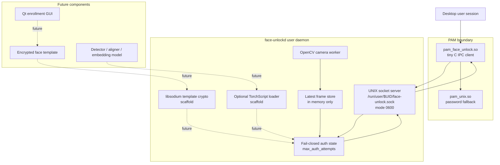
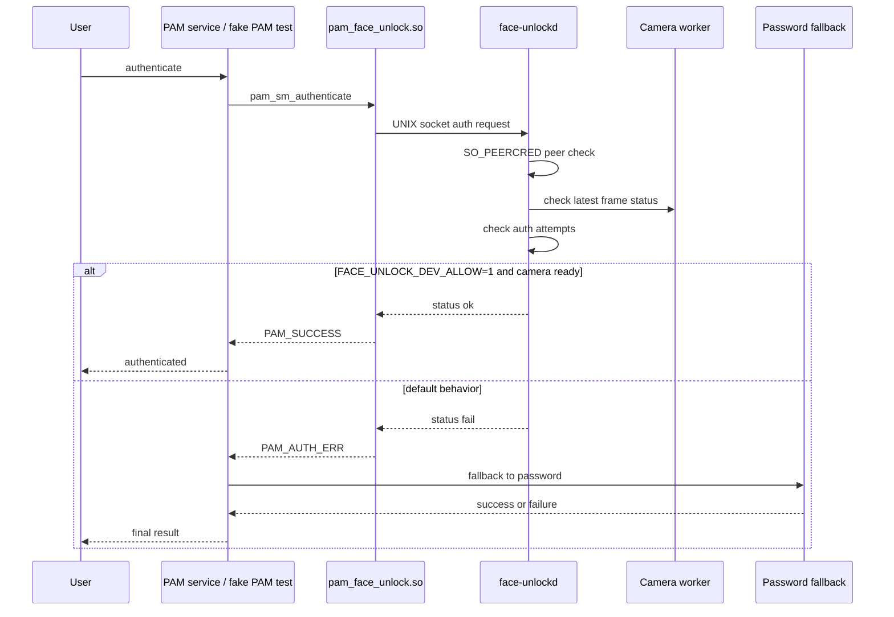

# face-unlock-linux

Experimental, safety-first face unlock infrastructure for Ubuntu Linux.

face-unlock-linux is building a local, user-controlled face unlock system for Ubuntu 24.04 using a user daemon, UNIX socket IPC, a minimal PAM bridge, OpenCV, encrypted template storage scaffolding, and optional TorchScript model loading.

This repository is currently an infrastructure prototype.

It is not real biometric authentication yet.

## Why this project exists

Linux desktop face unlock projects often become risky because heavy code gets too close to PAM, or installers modify authentication files too early.

This project takes the opposite approach:

- keep PAM tiny
- run camera/model code as the user
- fail closed by default
- never modify real PAM service files without explicit consent
- keep password fallback available
- document rollback before installation
- avoid storing biometric data unless explicitly requested
- build every step slowly and audibly

## Current status

Current target milestone:

    v0.1.0-alpha

What works today:

- documented open-source repository
- CMake build
- GitHub Actions CI on Ubuntu 24.04
- CTest support
- Debian package generation with CPack
- C++17 user daemon
- OpenCV camera one-shot probe
- OpenCV camera loop mode
- camera worker thread
- UNIX domain socket server
- socket permissions set to 0600
- SO_PEERCRED peer credential logging
- same-UID socket peer policy
- JSON-ish socket operations
- fail-closed auth operation
- max auth attempt enforcement
- development-only auth gate
- minimal PAM IPC module
- fake PAM service testing
- fake PAM install/remove scripts
- systemd user service install/remove scripts
- sudo PAM inspection script
- libsodium encrypted template storage scaffold
- crypto self-test
- Python safe capture prototype
- TorchScript export stub
- optional LibTorch loader scaffold

What does not work yet:

- real face recognition authentication
- real enrollment
- encrypted template matching
- calibrated thresholds
- liveness/spoof resistance
- Qt enrollment GUI
- production sudo integration
- lock-screen integration
- GDM, SDDM, or LightDM greeter integration

See:

    docs/project-status.md
    docs/releases/v0.1.0-alpha.md
    ROADMAP.md

## Project snapshot

| Area | Status |
|---|---|
| Repository | Public, documented, CI-enabled |
| Target OS | Ubuntu 24.04 LTS |
| Daemon | Working C++17 prototype |
| Camera | OpenCV one-shot, loop, and worker thread |
| IPC | UNIX socket with 0600 permissions |
| Peer checks | SO_PEERCRED logging and same-UID policy |
| PAM | Minimal C IPC module |
| PAM testing | Fake PAM service only |
| Auth default | Fail-closed |
| Dev auth | Explicit FACE_UNLOCK_DEV_ALLOW=1 only |
| Templates | libsodium encrypted storage scaffold |
| Models | TorchScript export/load scaffolds |
| Packaging | CPack Debian package skeleton |
| Real face recognition | Not implemented yet |
| Production sudo/lock screen | Not implemented yet |

## Architecture

The project separates privileged authentication glue from camera/model code.

## Authentication flow

Current auth is intentionally fail-closed unless development auth is explicitly enabled.

## What works vs what is planned

| Capability | Current state |
|---|---|
| Camera open/read | Working |
| Camera worker thread | Working |
| UNIX socket server | Working |
| Socket permissions | Working, 0600 |
| Peer credential logging | Working, SO_PEERCRED |
| PAM IPC module | Working |
| Fake PAM test | Working |
| systemd user service | Working helper scripts |
| Debian package | Working skeleton |
| Crypto self-test | Working |
| Python capture prototype | Working, saves nothing by default |
| TorchScript export stub | Working |
| Optional LibTorch loader | Scaffolded |
| Real face detection in daemon | Planned |
| Real embedding matching | Planned |
| Encrypted enrollment templates | Planned |
| Qt enrollment GUI | Planned |
| sudo integration | Planning only |
| Lock-screen integration | Planned |
| Greeter integration | Planned |

## Security model

Core rules:

- default auth fails closed
- password fallback must remain available
- PAM module stays minimal
- heavy dependencies stay outside PAM
- daemon runs as the user
- IPC uses a UNIX domain socket
- socket permissions are 0600
- peer credentials are checked with SO_PEERCRED
- templates must be encrypted at rest
- no raw image telemetry
- no silent biometric storage
- no automatic edits to real PAM service files

The PAM module must not link to:

- OpenCV
- LibTorch
- Qt
- CUDA
- TensorRT
- Python
- libsodium

Audit locally:

    ldd build/pam/pam_face_unlock.so

See:

    SECURITY.md
    docs/threat-model.md
    docs/pam-safety.md

## Quickstart for developers

Target platform:

- Ubuntu 24.04 LTS
- x86_64
- internal or USB webcam

Install development dependencies:

    ./setup-dev.sh

Build:

    ./scripts/build.sh

Run automated tests:

    ./scripts/test.sh

Run full local verification:

    ./scripts/verify-local.sh

## Run daemon manually

One-shot camera probe:

    ./build/daemon/face-unlockd --camera 0

Expected important output:

    camera_status: opened
    frame_status: ok
    status: ok

Run daemon mode:

    ./build/daemon/face-unlockd --camera 0 --daemon

In another terminal:

    ./scripts/test-socket-client.sh ping
    ./scripts/test-socket-client.sh camera_status
    ./scripts/test-socket-client.sh auth

Default auth should fail closed:

    status fail
    reason auth_not_implemented

## Development-only auth

Development auth is disabled by default.

Manual dev-only test:

    FACE_UNLOCK_DEV_ALLOW=1 ./build/daemon/face-unlockd --camera 0 --daemon

Then:

    ./scripts/test-socket-client.sh auth

Expected dev-only response:

    status ok
    reason dev_allow_camera_ready

Warning:

FACE_UNLOCK_DEV_ALLOW=1 is only for development testing.

Never use it as real authentication.

## PAM testing

Use only the fake PAM service flow during development.

Install fake test service:

    ./scripts/install-fake-pam-test.sh

Run fake PAM test:

    pamtester face-unlock-test "$USER" authenticate

Remove fake test service:

    ./scripts/remove-fake-pam-test.sh

Documentation:

    docs/pam-fake-service-test.md

This fake test does not modify sudo, login, lock-screen, GDM, SDDM, LightDM, or common-auth PAM files.

## systemd user service

Install daemon as a user service:

    ./scripts/install-user-service.sh

Check status:

    systemctl --user status face-unlockd.service

Test IPC:

    ./scripts/test-socket-client.sh ping
    ./scripts/test-socket-client.sh auth

Remove service:

    ./scripts/remove-user-service.sh

Documentation:

    docs/systemd-user-service.md

The user service runs with:

    FACE_UNLOCK_DEV_ALLOW=0

So auth remains fail-closed by default.

## sudo integration status

sudo integration is not installed yet.

Read-only inspection:

    ./scripts/inspect-sudo-pam.sh

Documentation:

    docs/sudo-integration-plan.md

Do not manually edit:

    /etc/pam.d/sudo
    /etc/pam.d/common-auth
    /etc/pam.d/gdm-password
    /etc/pam.d/sddm
    /etc/pam.d/lightdm

## Python prototypes

Safe default capture test:

    python3 python/prototype_capture.py --camera 0 --duration-seconds 10

By default, this saves nothing.

Saving crops requires explicit privacy flags:

    --save-crops
    --i-understand-privacy-risk

Documentation:

    docs/python-prototypes.md

## TorchScript model stub

Export dummy TorchScript embedding stub:

    python3 python/export_torchscript_stub.py

Generated model:

    models/embedding_stub.pt

Model files are ignored by Git.

Documentation:

    docs/model-export.md
    docs/libtorch-loader.md

## Encrypted template storage scaffold

Run crypto self-test:

    ./build/daemon/face-unlock-crypto-selftest

Documentation:

    docs/template-storage.md

Current crypto scaffold uses placeholder bytes only.

It does not store real face templates or images.

## Configuration

Optional user config:

    ~/.config/face-unlock/config.json

Write default config:

    ./scripts/write-default-config.sh

Documentation:

    docs/configuration.md

Current supported fields:

- camera_index
- max_auth_attempts

## Debian package

Build package:

    ./scripts/package-deb.sh

Inspect package:

    dpkg-deb -c build/*.deb
    dpkg-deb -I build/*.deb

Documentation:

    docs/packaging.md

The package does not automatically modify PAM files or enable authentication integration.

## CI

GitHub Actions workflow:

    .github/workflows/build.yml

CI checks:

- documentation
- build
- tests
- daemon CLI smoke test
- PAM dependency audit
- Debian package build
- artifact upload

Documentation:

    docs/ci.md

## Release process

Prepare release:

    ./scripts/prepare-release.sh v0.1.0-alpha

Release docs:

    docs/release-process.md
    docs/releases/v0.1.0-alpha.md

The prepare script does not tag or publish automatically.

## Repository layout

<pre>
daemon/       C++ daemon, crypto scaffold, CMake targets
pam/          minimal C PAM IPC module
python/       prototype capture and TorchScript export scripts
models/       local model artifact docs; generated models ignored
packaging/    systemd user service template
scripts/      build, test, packaging, setup, verification helpers
docs/         architecture, security, testing, packaging, release docs
.github/      issue templates and GitHub Actions workflows
</pre>

## Roadmap

Near-term:

- v0.1.0-alpha release checklist
- safer sudo installer planning
- encrypted template CLI scaffold
- real embedding loader experimentation
- enrollment data format design

Later:

- real face detector and alignment
- encrypted enrollment templates
- matching thresholds
- Qt enrollment GUI
- lock-screen integration
- greeter integration
- liveness/spoof resistance
- CUDA/TensorRT optimization

See:

    ROADMAP.md

## Contributing

Read:

    CONTRIBUTING.md
    CODE_OF_CONDUCT.md
    SECURITY.md

Security-sensitive changes require extra care, especially changes involving:

- PAM
- IPC
- template encryption
- installer behavior
- sudo/login/lock-screen integration

## Safety warning

Authentication software can lock you out of your system if configured incorrectly.

During development:

- do not modify real PAM service files manually
- keep a root shell open when testing PAM changes
- test with fake PAM service first
- keep password authentication as fallback
- never make face unlock the only auth method
- never use FACE_UNLOCK_DEV_ALLOW=1 as real authentication

## License

Apache License 2.0.

See:

    LICENSE

## sudo dry-run planner

sudo integration is still not installed.

Dry-run planner:

    ./scripts/plan-sudo-pam-install.sh

Documentation:

    docs/sudo-safe-installer.md

The planner prints a proposed sudo PAM diff and rollback commands but makes no changes.

## Guarded sudo apply and rollback

sudo integration remains experimental.

Dry-run:

    ./scripts/apply-sudo-pam-install.sh

Apply with multiple confirmations:

    ./scripts/apply-sudo-pam-install.sh --apply

Rollback:

    ./scripts/rollback-sudo-pam.sh --latest

Documentation:

    docs/sudo-apply-and-rollback.md

Do not apply sudo integration unless you have a root-authenticated recovery shell open.

## sudo root-peer policy

For future sudo support, the daemon allows root-owned socket peers only for auth requests.

Documentation:

    docs/sudo-root-peer-policy.md

This does not enable sudo integration by itself. It only prepares the daemon peer policy for sudo PAM behavior.

## sudo manual test results

Manual guarded sudo integration testing is documented in:

    docs/sudo-test-results.md

The successful passwordless sudo path used development-only auth:

    FACE_UNLOCK_DEV_ALLOW=1

This is not real biometric authentication and must not be used as production auth.

## Template CLI scaffold

Encrypted placeholder template tool:

    ./build/daemon/face-unlock-template-tool

Documentation:

    docs/template-cli.md

Create placeholder:

    ./build/daemon/face-unlock-template-tool create-placeholder --i-understand-placeholder

Check status:

    ./build/daemon/face-unlock-template-tool status

Delete:

    ./build/daemon/face-unlock-template-tool delete --yes

This is not real enrollment yet.

## Python embedding prototype

Prototype embedding script:

    python/prototype_embed.py

Documentation:

    docs/python-embedding-prototype.md

This uses a random stub model and is not real face recognition.

Writing embeddings requires explicit biometric-risk consent.

## Enrollment manifest scaffold

Planned enrollment metadata format:

    docs/enrollment-format.md

Example manifest:

    schemas/enrollment-manifest.example.json

Schema scaffold:

    schemas/enrollment-manifest.schema.json

The manifest is metadata only and must not contain raw face images, unencrypted embeddings, or encryption keys.

## Placeholder enrollment manifest

The template tool now writes placeholder enrollment metadata:

    ~/.local/share/face-unlock/enrollment.json

alongside:

    ~/.local/share/face-unlock/template.enc

This is placeholder-only and not real biometric enrollment.

## Daemon enrollment status

Daemon socket responses now include enrollment manifest status:

    "enrollment":"missing"
    "enrollment":"placeholder"

Real biometric enrollment is still not implemented.

## Enrollment manifest validation

Validate the example manifest:

    scripts/validate-enrollment-manifest.py schemas/enrollment-manifest.example.json

Documentation:

    docs/manifest-validation.md

## Qt enrollment GUI scaffold

Optional Qt6 GUI scaffold:

    cmake -S . -B build-gui -DBUILD_GUI=ON
    cmake --build build-gui
    ./build-gui/gui/face-unlock-enroll

Documentation:

    docs/gui.md

The GUI currently shows consent/status only. It does not access the camera or save biometric data.

## GUI Forget Me scaffold

The optional Qt GUI can display prototype template/enrollment status and delete placeholder files with confirmation.

It deletes only:

    ~/.local/share/face-unlock/template.enc
    ~/.local/share/face-unlock/enrollment.json

It does not modify PAM or authentication settings.

## Brightness assist planning

Brightness assist is planned for future enrollment low-light support.

Current status:

- GUI placeholder only
- no brightness changes performed

Documentation:

    docs/brightness-assist.md

## GUI pose slots scaffold

The optional Qt GUI includes placeholder enrollment pose slots:

- Center
- Left
- Right
- Up
- Down

This is UI-only. No camera capture or enrollment data is saved.

## GUI CI

The optional Qt GUI has a separate manual GitHub Actions workflow:

    .github/workflows/gui-build.yml

It builds with:

    -DBUILD_GUI=ON

The main CI workflow keeps GUI disabled by default.

## GUI quality checklist scaffold

The optional Qt GUI includes a placeholder enrollment quality checklist.

This is UI-only. No camera analysis is performed yet.

## GUI camera preview placeholder

The optional Qt GUI includes a camera preview placeholder panel.

It does not access the camera yet.

Documentation:

    docs/gui-camera-preview.md
