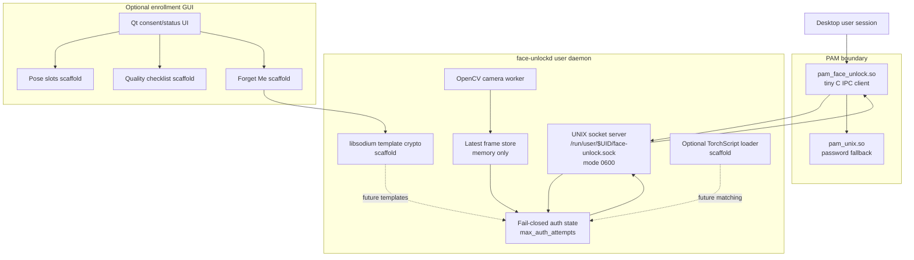
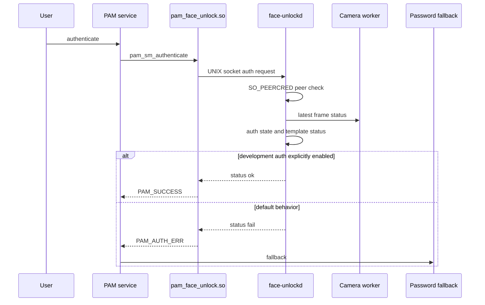

# face-unlock-linux

Experimental, safety-first face unlock infrastructure for Ubuntu Linux.

face-unlock-linux is building a local, user-controlled face unlock system for Ubuntu 24.04 using a user daemon, UNIX socket IPC, a minimal PAM bridge, OpenCV, encrypted template storage scaffolding, Qt GUI scaffolding, and optional TorchScript model loading.

> Current status: alpha infrastructure prototype.
>
> This is not real biometric authentication yet.

## Why this project exists

Authentication projects are risky when heavy camera/model code runs inside PAM or when installers modify system authentication files too early.

This project is built around the opposite approach:

- keep PAM tiny and auditable
- run camera/model work in a normal user daemon
- use local-only UNIX socket IPC
- check socket peer credentials
- fail closed by default
- keep password fallback available
- encrypt template data at rest
- never store biometric data silently
- require explicit consent for risky actions
- document rollback before integration

## Current status

| Area | Status |
|---|---|
| Target OS | Ubuntu 24.04 LTS |
| Release | v0.1.0-alpha infrastructure prototype |
| Daemon | Working C++17 prototype |
| Camera | OpenCV one-shot, loop, and worker thread |
| IPC | UNIX socket with 0600 permissions |
| Peer checks | SO_PEERCRED logging and policy |
| PAM | Minimal C IPC module |
| PAM testing | Fake PAM service and guarded sudo test flow |
| Auth default | Fail-closed |
| Dev auth | Explicit FACE_UNLOCK_DEV_ALLOW=1 only |
| Root sudo peer | Explicit FACE_UNLOCK_ALLOW_ROOT_AUTH=1 only |
| Templates | libsodium encrypted placeholder scaffold |
| Enrollment | Manifest scaffold only |
| GUI | Optional Qt consent/status scaffold |
| Models | TorchScript export/load scaffolds |
| Packaging | CPack Debian package skeleton |
| Real face recognition | Not implemented yet |
| Production lock-screen/login | Not implemented yet |

Detailed status:

    docs/project-status.md
    docs/releases/v0.1.0-alpha.md

## Architecture

Detailed architecture:

    docs/architecture.md

## Authentication flow

## What works today

Developer-safe flows:

- build locally
- run daemon manually
- run daemon as a user service
- test socket IPC
- build PAM module
- test PAM with fake PAM service
- run guarded sudo dry-run and rollback flow
- create/delete encrypted placeholder template
- create/delete placeholder enrollment manifest
- validate manifest JSON
- run crypto self-test
- build Debian package
- run CI
- build optional Qt GUI

## What does not work yet

Not implemented:

- real face detection in daemon
- real face alignment
- real embedding matching
- real biometric enrollment
- secure key management for real templates
- liveness/spoof resistance
- production sudo integration
- lock-screen integration
- GDM/SDDM/LightDM greeter integration
- production-ready Qt enrollment flow

## Quickstart

Install development dependencies:

    ./setup-dev.sh

Build:

    ./scripts/build.sh

Run tests:

    ./scripts/test.sh

Run full local verification:

    ./scripts/verify-local.sh

Run daemon camera probe:

    ./build/daemon/face-unlockd --camera 0

Run daemon mode:

    ./build/daemon/face-unlockd --camera 0 --daemon

In another terminal:

    ./scripts/test-socket-client.sh ping
    ./scripts/test-socket-client.sh camera_status
    ./scripts/test-socket-client.sh auth

Default auth should fail closed.

## Common development commands

| Task | Command |
|---|---|
| Check docs | ./scripts/check-docs.sh |
| Check JSON | ./scripts/check-json.sh |
| Check scripts | ./scripts/check-scripts.sh |
| Build | ./scripts/build.sh |
| Run tests | ./scripts/test.sh |
| Full verification | ./scripts/verify-local.sh |
| Audit dependencies | ./scripts/audit-dependencies.sh |
| Build Debian package | ./scripts/package-deb.sh |
| Build GUI | cmake -S . -B build-gui -DBUILD_GUI=ON && cmake --build build-gui |

## PAM and sudo safety

Safe fake PAM test:

    ./scripts/install-fake-pam-test.sh
    pamtester face-unlock-test "$USER" authenticate
    ./scripts/remove-fake-pam-test.sh

sudo dry-run planner:

    ./scripts/plan-sudo-pam-install.sh

guarded sudo apply and rollback:

    ./scripts/apply-sudo-pam-install.sh
    ./scripts/apply-sudo-pam-install.sh --apply
    ./scripts/rollback-sudo-pam.sh --latest

Read before touching sudo:

    docs/pam-safety.md
    docs/pam-fake-service-test.md
    docs/sudo-integration-plan.md
    docs/sudo-apply-and-rollback.md
    docs/sudo-root-peer-policy.md
    docs/sudo-troubleshooting.md

Do not modify real PAM files unless you understand the rollback path.

## Documentation

Start here:

    docs/README.md

Important docs:

| Topic | Document |
|---|---|
| Architecture | docs/architecture.md |
| Project status | docs/project-status.md |
| Security policy | SECURITY.md |
| Threat model | docs/threat-model.md |
| PAM safety | docs/pam-safety.md |
| sudo troubleshooting | docs/sudo-troubleshooting.md |
| Dependency audit | docs/dependency-audit.md |
| Template storage | docs/template-storage.md |
| Enrollment format | docs/enrollment-format.md |
| GUI | docs/gui.md |
| Model evaluation | docs/model-evaluation-plan.md |
| Packaging | docs/packaging.md |
| CI | docs/ci.md |
| Release process | docs/release-process.md |
| Changelog | CHANGELOG.md |

## Repository layout

| Path | Purpose |
|---|---|
| daemon/ | C++ daemon, crypto scaffold, template tool |
| pam/ | minimal C PAM IPC module |
| gui/ | optional Qt enrollment GUI scaffold |
| python/ | capture, embedding, model export prototypes |
| models/ | local model artifact docs |
| schemas/ | enrollment manifest and metrics schemas/examples |
| packaging/ | systemd and packaging assets |
| scripts/ | build, test, setup, safety helpers |
| docs/ | architecture, security, testing, release docs |
| .github/ | issue templates and workflows |

## Security warning

This is authentication-related software.

During development:

- keep password fallback available
- do not make face unlock the only auth method
- keep a recovery shell open for PAM tests
- never use development auth as production auth
- do not commit biometric data
- do not commit model artifacts by default
- inspect PAM diffs before applying

## Release

Current alpha release:

    v0.1.0-alpha

Release notes:

    docs/releases/v0.1.0-alpha.md

Prepare release:

    ./scripts/prepare-release.sh v0.1.0-alpha

## Contributing

Read:

    CONTRIBUTING.md
    CODE_OF_CONDUCT.md
    SECURITY.md

Security-sensitive changes require extra review.

## License

Apache License 2.0.

See:

    LICENSE

## Key management scaffold

Development key tool:

    ./build/daemon/face-unlock-key-tool

Documentation:

    docs/key-management.md

Production key management is not implemented yet.

## Development-key encrypted placeholder

Create a local development key:

    ./build/daemon/face-unlock-key-tool create-dev-key --i-understand-dev-key-risk

Create a placeholder template using it:

    ./build/daemon/face-unlock-template-tool create-placeholder --i-understand-placeholder --use-dev-key

Verify decryptability without printing plaintext:

    ./build/daemon/face-unlock-template-tool verify-decrypt --use-dev-key

This is not production key management.

## Key/template integration self-test

Run the development key plus placeholder template integration test:

    ./scripts/test-key-template-flow.sh

CTest also runs this as:

    key_template_flow

The test uses a temporary HOME and does not touch real user template files.

## Template decryptability status

The template tool status command reports whether a placeholder template may be decryptable with the development key.

It does not decrypt or print plaintext by default.

## Daemon key/decryptability metadata

Daemon socket responses include key/decryptability metadata.

The daemon reports whether a placeholder template may be decryptable with the development key, but does not decrypt templates yet.

## Daemon metadata integration test

CTest includes a daemon metadata integration test that verifies template, enrollment, key, and decryptability fields over the daemon socket without requiring a camera.

## Daemon template_status operation

Query template/key/decrypt metadata:

    ./scripts/test-socket-client.sh template_status

The operation can verify development-key decryptability without returning plaintext.

## Daemon template_status operation

Query template/key/decrypt metadata:

    ./scripts/test-socket-client.sh template_status

The operation can verify development-key decryptability without returning plaintext.

## Key-aware auth failure reasons

The daemon auth path now reports more specific fail-closed reasons based on template/key state, such as template_missing, key_missing, template_decrypt_failed, and matcher_not_implemented.

Real matching is still not implemented.

## Auth reason integration test

CTest includes an auth reason integration test that verifies fail-closed reasons for missing templates, non-decryptable templates, missing keys, and matcher-not-implemented state.

## Current development target

Current post-alpha development target:

    v0.2.0-dev-auth-sudo

Release planning:

    docs/releases/v0.2.0-dev-auth-sudo.md

## Faster builds

The build script uses Ninja and ccache when available.

Documentation:

    docs/fast-builds.md

Install tools:

    sudo apt install ninja-build ccache

Build:

    ./scripts/build.sh

## Split CI/package workflows

Main CI is optimized for faster feedback.

Package artifacts are built by a separate workflow:

    .github/workflows/package.yml

Release assets are built by:

    .github/workflows/release.yml

## Shared CI dependency installer

CI workflows use:

    ./scripts/ci-install-deps.sh

Documentation:

    docs/ci-dependencies.md

## Detector prototype

Python detector prototype:

    python3 python/prototype_detect.py --camera 0 --duration-seconds 10

Documentation:

    docs/detector-prototype.md

Current backend is Haar baseline. YuNet backend is planned.

## Detector backend fallback

The Python detector prototype defaults to auto mode.

If Haar detection is unavailable in the local cv2 build, it falls back to noop mode so the camera pipeline can still be tested.

## Python detector smoke test

Run:

    ./scripts/test-python-detectors.sh

This verifies detector imports and noop backend behavior without requiring a camera.

## Detector smoke test in CI

CI runs the Python detector smoke test using the noop backend.

The test does not require a camera or Python OpenCV objdetect support.

## Detector output format

Detector metadata format:

    docs/detector-output-format.md

Example:

    schemas/detector-output.example.json

## Detector output validator

Validate detector output metadata:

    scripts/validate-detector-output.py schemas/detector-output.example.json

## Detector output generation test

Run:

    ./scripts/test-detector-output-generation.sh

This validates generated detector output without requiring a camera.

## Daemon detector scaffold

The C++ daemon now includes a detector abstraction scaffold.

Current backend:

    noop

Documentation:

    docs/daemon-detector-scaffold.md

## detector_status operation

Query detector metadata:

    ./scripts/test-socket-client.sh detector_status

Current backend is noop.

## Detector backend config

Current C++ daemon detector backend:

    noop

CLI:

    ./build/daemon/face-unlockd --detector noop --serve

Config:

    "detector_backend": "noop"

## GUI daemon detector status query

The optional Qt GUI can query the running daemon for detector_status and display the raw JSON response.

This is a safe bridge toward GUI/daemon integration.

## GUI daemon response panel

The optional Qt GUI now displays daemon detector_status responses in a persistent panel.

## GUI parsed detector summary

The optional Qt GUI displays a parsed detector_status summary and the raw daemon JSON response.

## GUI tabbed layout

The optional Qt GUI uses scrollable tabs so the enrollment scaffold fits laptop screens better.

## GUI tabbed layout

The optional Qt GUI uses scrollable tabs so the enrollment scaffold fits laptop screens better.

## GUI daemon JSON parsing

The optional Qt GUI parses daemon metadata responses with Qt JSON APIs.

## GUI template_status query

The optional Qt GUI can query template_status and display parsed template/enrollment/key/decryptability metadata.

## GUI refresh daemon panels

The optional Qt GUI can refresh detector, template, and auth diagnostic daemon panels with one button.

## GUI build helper

Build the optional Qt GUI:

    ./scripts/build-gui.sh

Run:

    ./build-gui/gui/face-unlock-enroll
