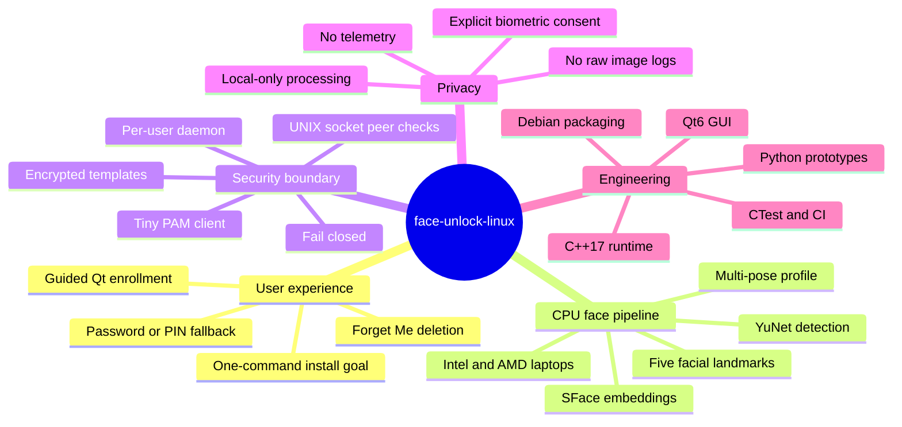
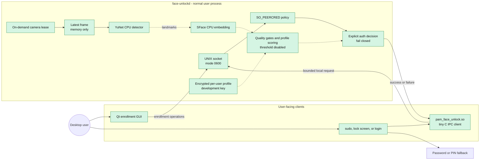
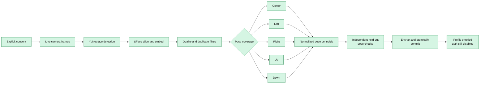
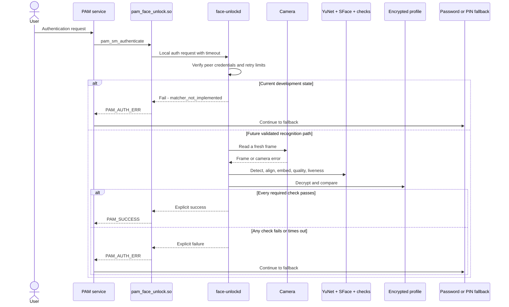

# face-unlock-linux

CPU-first, local-only face recognition infrastructure for Linux.

The product goal is a lightweight add-on that users can install, open, enroll
with a guided head-turn flow, and use without depending on CUDA, discrete GPU
drivers, or cloud services. Intel and AMD laptop CPUs are the primary runtime
target.

> This repository is still a development prototype. Real biometric matching,
> liveness protection, and production PAM integration are not finished. It
> must not be used as the only authentication method.

## Product direction

The intended experience is simple:

1. Install the package.
2. Open the enrollment GUI.
3. Look at the camera and slowly turn left, right, up, and down.
4. Let the local CPU build an encrypted multi-pose face profile.
5. Keep password or PIN fallback available for every login.

Enrollment does not fine-tune a neural network. Pretrained CPU models process
many frames, reject poor or duplicate samples, and build a compact user profile
from normalized embeddings.

The project is being built in small, testable stages. A one-command production
installer is a goal, not a capability of the current release.

## Project map

```mermaid
mindmap
  root((face-unlock-linux))
    User experience
      One-command install goal
      Guided Qt enrollment
      Password or PIN fallback
      Forget Me deletion
    CPU face pipeline
      YuNet detection
      Five facial landmarks
      SFace embeddings
      Multi-pose profile
      Intel and AMD laptops
    Security boundary
      Tiny PAM client
      Per-user daemon
      UNIX socket peer checks
      Fail closed
      Encrypted templates
    Privacy
      Local-only processing
      No telemetry
      No raw image logs
      Explicit biometric consent
    Engineering
      C++17 runtime
      Python prototypes
      Qt6 GUI
      CTest and CI
      Debian packaging
```

## Current status

| Area | Current implementation |
|---|---|
| Platform | Ubuntu 24.04 and 26.04 LTS, x86_64 |
| Daemon | C++17 per-user process |
| Camera | on-demand OpenCV/V4L2 lease; one-shot and manual loop diagnostics |
| Detection | CPU YuNet in C++; noop and Haar fallbacks |
| Detection output | boxes, confidence, five landmarks, latency |
| Recognition | native quality/score pipeline; acceptance threshold disabled |
| Enrollment | daemon-owned five-pose training, independent held-out validation, and encrypted commit |
| Profile builder | C++ and Python; versioned encrypted round-trip tested |
| IPC | UNIX socket with mode 0600 and peer credential checks |
| PAM | minimal C IPC client with bounded timeout |
| Templates | libsodium-encrypted native profiles; development key tooling only |
| GUI | Qt6 daemon enrollment client with consent, guided poses, progress, quality, cancel, commit, and Forget Me |
| Authentication | fail-closed; real matcher not connected |
| Lock screen | bounded policy and camera lease; guarded Hyprlock PAM planning; automatic unlock pending |
| Liveness | not implemented |
| Packaging | development Debian/CPack skeleton |

The Qt enrollment flow is connected to the daemon and profiles must pass an
independent held-out check before commit. The current phase is calibration,
benchmarking, and live-preview design. See [project status](docs/project-status.md)
and the [roadmap](ROADMAP.md).

## Delivery path

```mermaid
flowchart LR
    Foundation["Foundation<br/>daemon, IPC, PAM boundary, crypto"] --> Runtime["Current phase<br/>C++ CPU recognition and profiles"]
    Runtime --> Enrollment["Guided enrollment<br/>daemon operations and Qt progress"]
    Enrollment --> Hardening["Security hardening<br/>thresholds, liveness, recovery"]
    Hardening --> Packaging["Daily-use packaging<br/>models, service, reversible opt-in"]
    Packaging --> Integration["Desktop integration<br/>sudo, lock screen, login"]
    Integration --> Stable["v1.0 review<br/>accuracy, rollback, external audit"]

    classDef complete fill:#d5f5e3,stroke:#1e8449,color:#111
    classDef active fill:#fff3cd,stroke:#b7950b,color:#111
    classDef planned fill:#eaecee,stroke:#626567,color:#111

    class Foundation complete
    class Runtime complete
    class Enrollment active
    class Hardening,Packaging,Integration,Stable planned
```

Green is implemented foundation, yellow is active work, and gray is planned.

## Architecture

```mermaid
flowchart LR
    User((Desktop user))
    Password["Password or PIN fallback"]

    subgraph Clients["User-facing clients"]
        GUI["Qt enrollment GUI"]
        PAMService["sudo, lock screen, or login"]
        PAM["pam_face_unlock.so<br/>tiny C IPC client"]
    end

    subgraph Daemon["face-unlockd - normal user process"]
        IPC["UNIX socket<br/>mode 0600"]
        Peer["SO_PEERCRED policy"]
        Camera["On-demand camera lease"]
        Frame["Latest frame<br/>memory only"]
        YuNet["YuNet CPU detector"]
        SFace["SFace CPU embedding"]
        Matcher["Quality gates and profile scoring<br/>threshold disabled"]
        Decision["Explicit auth decision<br/>fail closed"]
        Crypto["Encrypted per-user profile<br/>development key"]
    end

    User --> GUI
    User --> PAMService
    PAMService --> PAM
    PAM -->|"bounded local request"| IPC
    GUI -->|"enrollment operations"| IPC
    IPC --> Peer
    Peer --> Decision

    Camera --> Frame
    Frame --> YuNet
    YuNet -.->|"landmarks"| SFace
    SFace -.-> Matcher
    Crypto -.-> Matcher
    Matcher -.-> Decision

    Decision -->|"success or failure"| PAM
    PAMService --> Password

    classDef implemented fill:#d5f5e3,stroke:#1e8449,color:#111
    classDef planned fill:#eaecee,stroke:#626567,color:#111

    class GUI,PAMService,PAM,IPC,Peer,Camera,Frame,YuNet,SFace,Matcher,Crypto,Decision implemented
```

Solid connections are implemented infrastructure. The GUI drives enrollment but
does not receive camera frames; authentication acceptance stays disabled.

The PAM module never opens the camera or loads a model. Heavy work stays in the
unprivileged daemon. The socket uses mode 0600 and SO_PEERCRED checks.

Read the [architecture](docs/architecture.md) and
[threat model](docs/threat-model.md) before changing authentication behavior.

For the Ubuntu 26/Hyprlock boundary, see [Hyprland integration](docs/hyprland.md).

## CPU model baseline

The development baseline is:

- version-selected YuNet: 2022mar on OpenCV 4.6, 2023mar on newer OpenCV 4.x
- SFace 2021dec for alignment and embeddings
- OpenCV DNN backend
- OpenCV CPU target
- no required CUDA, TensorRT, OpenCL, or vendor GPU runtime

Download pinned model files and verify their SHA-256 checksums:

    ./scripts/download-cpu-models.sh

The files are placed under models/ and ignored by Git.

Camera-free benchmark on an Intel i5-12500H with Ubuntu 24.04 and OpenCV 4.6:

| Operation | Development result |
|---|---:|
| Python YuNet 320x320 p50 | about 3.8 ms |
| Python SFace 112x112 p50 | about 9.9 ms |
| C++ YuNet blank-frame smoke inference | about 6.6 ms |
| C++ SFace 112x112 p50 / p95 | about 10.1 / 12.6 ms |
| Python benchmark peak RSS | about 277 MB |

A first on-device camera lease measurement opened the MSI laptop camera in
about 205-207 ms and delivered its first 640x480 frame in about 842-970 ms.
That range is a two-run development observation, not a compatibility claim.

These measurements validate runtime cost only. They do not measure recognition
accuracy, liveness, thermal behavior, or end-to-end authentication.

Run the benchmark locally:

    python3 python/benchmark_cpu_models.py --iterations 100

Measure cold camera access without saving frames:

    ./scripts/benchmark-camera-lease.sh --camera 0

Run the live score-only pipeline benchmark without saving frames:

    ./scripts/benchmark-native-verification.sh --camera 0 --iterations 20

## Developer quickstart

Clone and enter the repository:

    git clone https://github.com/justneeraj12/face-unlock-linux.git
    cd face-unlock-linux

Install development dependencies with an explicit confirmation prompt:

    ./setup-dev.sh

Download the CPU models:

    ./scripts/download-cpu-models.sh

Build and test:

    ./scripts/build.sh
    ./scripts/test.sh
    ./scripts/audit-dependencies.sh

Run the C++ YuNet smoke test:

    ./build/daemon/face-unlock-detector-selftest --yunet-model models/face_detection_yunet.onnx

Run the daemon with camera, CPU YuNet, and CPU SFace:

    ./build/daemon/face-unlockd --camera 0 --detector yunet --detector-model models/face_detection_yunet.onnx --recognizer-model models/face_recognition_sface_2021dec.onnx --daemon

In another terminal:

    ./scripts/test-socket-client.sh ping
    ./scripts/test-socket-client.sh camera_status
    ./scripts/test-socket-client.sh detector_status
    ./scripts/test-socket-client.sh enrollment_status
    ./scripts/test-socket-client.sh enrollment_start
    ./scripts/test-socket-client.sh enrollment_capture
    ./scripts/test-socket-client.sh auth

Enrollment capture accepts at most one qualified sample per request. The auth
request must still fail because thresholded authentication is not enabled.

## Guided enrollment prototype

```mermaid
flowchart LR
    Consent["Explicit consent"] --> Frames["Live camera frames"]
    Frames --> Detect["YuNet face detection"]
    Detect --> Embed["SFace align and embed"]
    Embed --> Filter["Quality and duplicate filters"]
    Filter --> Pose{"Pose coverage"}
    Pose --> Center["Center"]
    Pose --> Left["Left"]
    Pose --> Right["Right"]
    Pose --> Up["Up"]
    Pose --> Down["Down"]

    Center --> Profile["Normalized pose centroids"]
    Left --> Profile
    Right --> Profile
    Up --> Profile
    Down --> Profile

    Profile --> Validate["Independent held-out<br/>pose checks"]
    Validate --> Encrypt["Encrypt and atomically commit"]
    Encrypt --> Ready["Profile enrolled<br/>auth still disabled"]

    classDef implemented fill:#d5f5e3,stroke:#1e8449,color:#111

    class Consent,Frames,Detect,Embed,Filter,Pose,Center,Left,Right,Up,Down,Profile,Validate,Encrypt,Ready implemented
```

The native daemon and Qt client implement this enrollment pipeline. Held-out
samples are scored and discarded rather than added to the stored centroids.
Authentication acceptance remains deliberately disabled.

Run it with:

    python3 python/prototype_enroll_cpu.py --i-understand-biometric-risk

It guides the user through center, left, right, up, and down poses. It keeps
frames, aligned crops, and embeddings in memory and writes no biometric profile.

The next implementation step is to expose daemon enrollment start, status,
cancel, and commit operations, then connect them to the Qt GUI.

## Enrollment GUI

Build the optional Qt6 GUI:

    ./scripts/build-gui.sh

Run it:

    ./build-gui/gui/face-unlock-enroll

The GUI currently provides consent and privacy information, daemon status,
template status, pose and quality scaffolds, and placeholder-data deletion. It
does not yet perform real enrollment or enable authentication.

## Fail-closed authentication flow

```mermaid
sequenceDiagram
    actor User
    participant Service as PAM service
    participant Module as pam_face_unlock.so
    participant Daemon as face-unlockd
    participant Camera
    participant Pipeline as YuNet + SFace + checks
    participant Profile as Encrypted profile
    participant Password as Password or PIN fallback

    User->>Service: Authentication request
    Service->>Module: pam_sm_authenticate
    Module->>Daemon: Local auth request with timeout
    Daemon->>Daemon: Verify peer credentials and retry limits

    alt Current development state
        Daemon-->>Module: Fail - matcher_not_implemented
        Module-->>Service: PAM_AUTH_ERR
        Service->>Password: Continue to fallback
    else Future validated recognition path
        Daemon->>Camera: Read a fresh frame
        Camera-->>Daemon: Frame or camera error
        Daemon->>Pipeline: Detect, align, embed, quality, liveness
        Daemon->>Profile: Decrypt and compare
        alt Every required check passes
            Daemon-->>Module: Explicit success
            Module-->>Service: PAM_SUCCESS
        else Any check fails or times out
            Daemon-->>Module: Explicit failure
            Module-->>Service: PAM_AUTH_ERR
            Service->>Password: Continue to fallback
        end
    end
```

No detector result by itself can authenticate a user. Camera, model, profile,
quality, threshold, liveness, peer-policy, and timeout checks must all succeed.
Any missing or invalid state falls back to password or PIN.

## Safety model

Authentication software can lock users out. This project therefore requires:

- password or PIN fallback
- fail-closed behavior on every error
- no raw image or embedding logs
- encrypted per-user templates
- local-only processing
- explicit opt-in for development auth
- explicit review, backup, confirmation, and rollback for PAM changes
- a minimal dependency set inside the PAM module

Development-only switches:

    FACE_UNLOCK_DEV_ALLOW=1
    FACE_UNLOCK_ALLOW_ROOT_AUTH=1

They must never be enabled as production authentication defaults.

Do not edit sudo, common-auth, GDM, SDDM, or LightDM PAM files manually. Use
only the documented fake PAM flow while developing. Read
[PAM safety](docs/pam-safety.md) and
[sudo apply and rollback](docs/sudo-apply-and-rollback.md).

## Testing

Fast local checks:

    ./scripts/check-scripts.sh
    ./scripts/check-docs.sh
    ./scripts/check-json.sh
    ./scripts/build.sh
    ./scripts/test.sh
    ./scripts/audit-dependencies.sh

Full verification and package inspection:

    ./scripts/verify-local.sh

CTest covers crypto, key/template handling, daemon metadata, fail-closed auth
reasons, detector backends, and CPU profile construction. Camera-dependent
quality and accuracy evaluation remain manual work.

The dependency audit ensures pam_face_unlock.so does not link OpenCV, Qt,
Torch, CUDA, TensorRT, Python, or libsodium.

## Repository layout

| Path | Purpose |
|---|---|
| daemon/ | C++ camera, detector, IPC, crypto, and template tools |
| pam/ | minimal C PAM IPC module |
| gui/ | optional Qt6 enrollment application |
| python/ | CPU model, enrollment, and evaluation prototypes |
| models/ | model provenance notes; weights are ignored |
| schemas/ | metadata schemas and examples |
| scripts/ | build, test, model, packaging, and safety helpers |
| packaging/ | systemd and package assets |
| docs/ | architecture, security, development, and release documentation |
| .github/ | CI workflows and contribution templates |

Generated directories such as build/, build-gui/, .venv/, local models, keys,
templates, captures, and evaluation output are excluded by .gitignore.

## Documentation

Start with the [documentation index](docs/README.md).

Most useful references:

- [Current project status](docs/project-status.md)
- [Architecture](docs/architecture.md)
- [CPU face profile](docs/cpu-face-profile.md)
- [C++ detector backends](docs/daemon-detector-scaffold.md)
- [Configuration](docs/configuration.md)
- [Testing](docs/testing.md)
- [Threat model](docs/threat-model.md)
- [Lock-screen authentication policy](docs/lock-screen-auth.md)
- [PAM safety](docs/pam-safety.md)
- [Key management](docs/key-management.md)
- [Packaging](docs/packaging.md)

## Contributing

Small, reviewable changes are preferred. Security-sensitive changes must
explain failure behavior, privacy impact, test coverage, and rollback.

Read [CONTRIBUTING.md](CONTRIBUTING.md),
[SECURITY.md](SECURITY.md), and
[CODE_OF_CONDUCT.md](CODE_OF_CONDUCT.md).

## License

Apache License 2.0. See [LICENSE](LICENSE).
