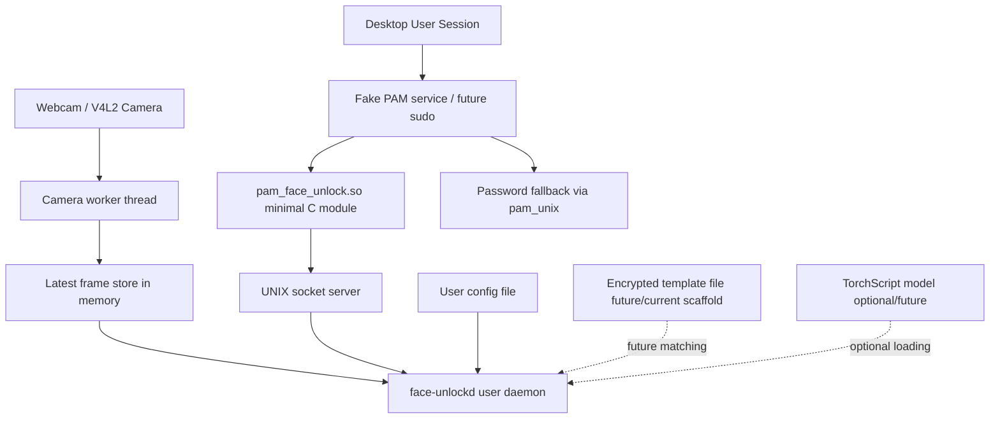
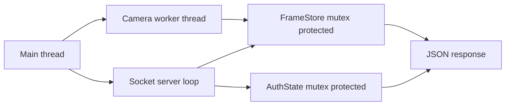
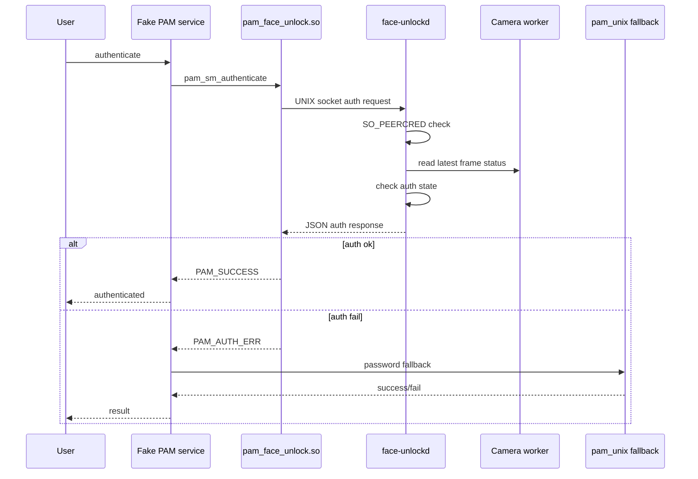
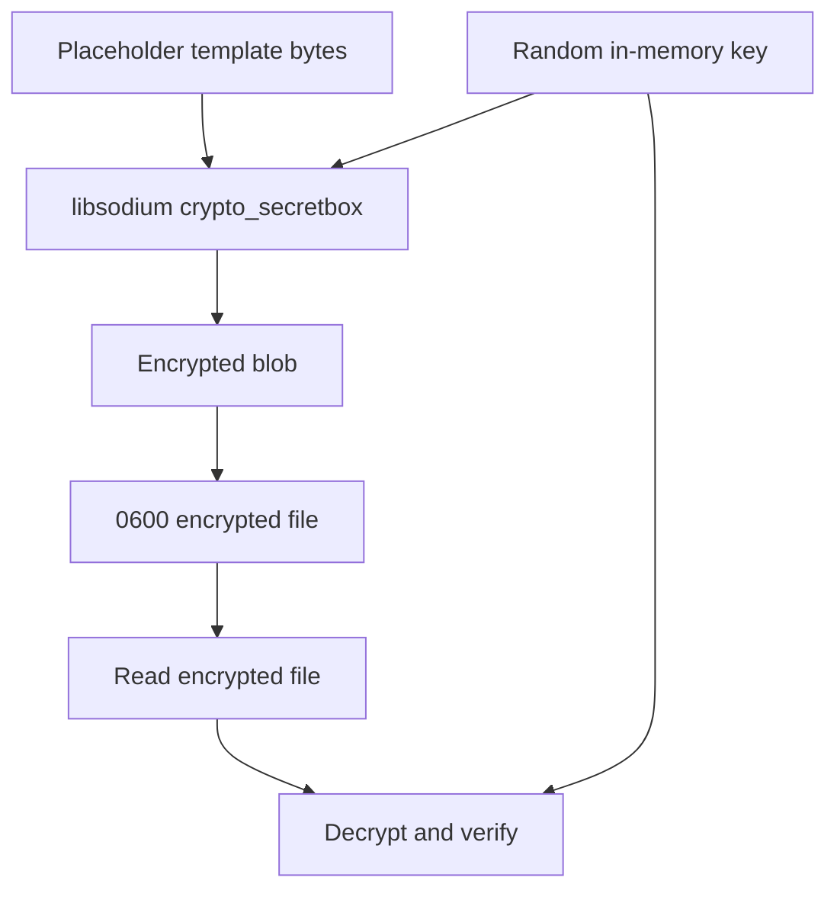
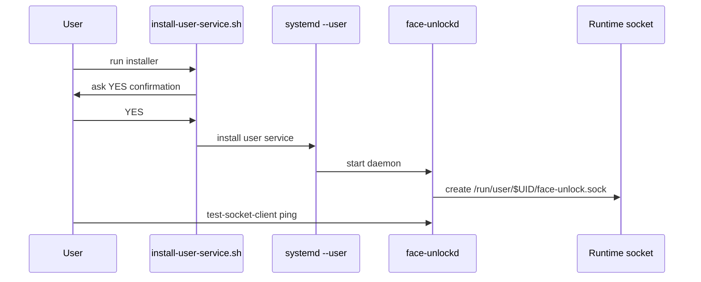

# Architecture

This document describes the technical architecture of face-unlock-linux.

The README provides the high-level overview. This file is the deeper implementation-oriented architecture document.

## Design principle

The central design rule is:

    Privileged or security-sensitive components must stay small.

In practice:

- the PAM module must stay minimal
- camera and model logic run in a normal user daemon
- templates are user-controlled
- auth fails closed by default
- real PAM service files are not modified automatically

## Current implementation status

Implemented today:

- C++17 user daemon
- OpenCV camera one-shot mode
- OpenCV camera loop mode
- camera worker thread
- latest-frame in-memory store
- UNIX domain socket server
- socket mode 0600
- SO_PEERCRED peer credential logging
- same-UID socket policy
- simple socket operations
- fail-closed auth operation
- max auth attempt enforcement
- development-only auth gate
- minimal C PAM IPC module
- fake PAM service testing
- systemd user service helpers
- encrypted template storage scaffold
- optional TorchScript loader scaffold

Not implemented yet:

- real face recognition
- real enrollment
- template matching
- Qt enrollment GUI
- production sudo integration
- lock-screen integration
- greeter/login integration
- liveness detection

## High-level system diagram

## Component overview

| Component | Location | Privilege | Current status | Responsibility |
|---|---|---:|---|---|
| User daemon | daemon/ | user | working prototype | camera, IPC, auth state |
| PAM module | pam/ | loaded by PAM | working fake-test prototype | tiny IPC client |
| Python prototypes | python/ | user | working prototype | capture and model export experiments |
| Config file | ~/.config/face-unlock/config.json | user | scaffold | camera index and auth attempt config |
| Template storage | ~/.local/share/face-unlock/template.enc | user | crypto scaffold | encrypted future template |
| systemd user service | packaging/systemd | user | working helper | starts daemon as user |
| Debian package | CPack | system install | skeleton | packages binaries/docs |

## Runtime daemon architecture

The daemon currently supports multiple modes:

| Mode | Command | Purpose |
|---|---|---|
| one-shot | face-unlockd --camera 0 | open camera, read one frame, exit |
| loop | face-unlockd --camera 0 --loop | continuously read frames, print FPS |
| serve | face-unlockd --serve | socket server only |
| daemon | face-unlockd --camera 0 --daemon | camera worker plus socket server |
| model test | face-unlockd --model-test | optional TorchScript loader smoke test |

The most important mode is:

    face-unlockd --camera 0 --daemon

In daemon mode:

- the camera worker runs in a background thread
- frames are stored only in memory
- the socket server listens under XDG_RUNTIME_DIR
- socket requests can query status or request auth
- auth fails closed by default

## Daemon threading model

Threaded state:

| State | Protection | Purpose |
|---|---|---|
| FrameStore | std::mutex | latest camera frame and frame count |
| AuthState | std::mutex | failed auth attempts and remaining attempts |

Current limitation:

- the latest frame is copied into memory
- no detector or matcher runs yet
- no images are saved by daemon

## IPC socket

Current socket path:

    /run/user/$UID/face-unlock.sock

Equivalent:

    $XDG_RUNTIME_DIR/face-unlock.sock

Socket properties:

| Property | Current value |
|---|---|
| Type | UNIX domain socket |
| Mode | 0600 |
| Owner | desktop user |
| Peer check | SO_PEERCRED |
| Current peer policy | same UID only |
| Protocol | JSON-ish request/response |

Current accepted operations:

| Operation | Example request | Default response |
|---|---|---|
| ping | {"op":"ping"} | status ok |
| camera_status | {"op":"camera_status"} | status ok plus frame metadata |
| auth | {"op":"auth"} | status fail by default |
| unknown | anything else | status fail |

## IPC protocol examples

Ping request:

    {"op":"ping","client":"test-socket-client"}

Ping response:

    {"status":"ok","op":"ping","reason":"daemon_alive","camera":"ready"}

Camera status request:

    {"op":"camera_status","client":"test-socket-client"}

Camera status response:

    {"status":"ok","op":"camera_status","camera":"ready","frames_total":30,"frame_width":640,"frame_height":480,"frame_channels":3}

Auth request:

    {"op":"auth","client":"pam_face_unlock","pam_user":"user"}

Default auth response:

    {"status":"fail","op":"auth","reason":"auth_not_implemented"}

Development-only auth response when FACE_UNLOCK_DEV_ALLOW=1:

    {"status":"ok","op":"auth","reason":"dev_allow_camera_ready"}

Too many attempts response:

    {"status":"fail","op":"auth","reason":"too_many_attempts"}

## PAM flow

Current safe PAM testing uses a fake PAM service:

    /etc/pam.d/face-unlock-test

The real sudo/login/lock-screen PAM files are not modified.

Current fake PAM service pattern:

    auth sufficient pam_face_unlock.so timeout_ms=1000 debug
    auth required pam_unix.so
    account required pam_unix.so

This means:

- if face unlock succeeds, PAM can accept it
- if face unlock fails, password fallback remains available
- this is only used by pamtester during development

## PAM module constraints

The PAM module must stay minimal.

It should only:

- resolve the target user
- connect to the user daemon socket
- send an auth request
- wait for a bounded timeout
- parse success/failure
- return PAM_SUCCESS or PAM_AUTH_ERR

The PAM module must not link:

- OpenCV
- LibTorch
- Qt
- CUDA
- TensorRT
- Python
- libsodium

Audit command:

    ldd build/pam/pam_face_unlock.so

## Auth behavior

Default auth behavior:

| Condition | Response |
|---|---|
| daemon missing | PAM fails and fallback can continue |
| socket missing | PAM fails and fallback can continue |
| peer rejected | daemon returns fail |
| camera unavailable | auth fails |
| auth not implemented | auth fails |
| too many attempts | auth fails |
| FACE_UNLOCK_DEV_ALLOW unset | auth fails |
| FACE_UNLOCK_DEV_ALLOW=1 and camera ready | auth succeeds for development only |

Important:

    FACE_UNLOCK_DEV_ALLOW=1 must never be used as real authentication.

## Max auth attempts

The daemon reads:

    max_auth_attempts

from:

    ~/.config/face-unlock/config.json

Default:

    3

Current behavior:

- failed auth requests increment an in-memory counter
- after the limit, auth returns too_many_attempts
- successful development-only auth resets the counter
- restarting the daemon resets the counter

Future behavior:

- tie attempts to time windows
- add lockout cooldown
- integrate password fallback guidance
- expose clearer PAM reason codes

## Storage paths

| Purpose | Path | Current status |
|---|---|---|
| Runtime socket | /run/user/$UID/face-unlock.sock | implemented |
| User config | ~/.config/face-unlock/config.json | implemented scaffold |
| Template file | ~/.local/share/face-unlock/template.enc | crypto scaffold |
| Model stub | models/embedding_stub.pt | generated locally, ignored |
| Python samples | enrollment_samples/ | ignored by Git |
| systemd user service | ~/.config/systemd/user/face-unlockd.service | helper installed |
| daemon install path | ~/.local/bin/face-unlockd | helper installed |

## Template storage architecture

Current template storage is a crypto scaffold.

Current limitation:

- self-test uses placeholder bytes
- key is generated in memory
- key is not persisted
- no real face template is created yet

Future key options:

- kernel keyring
- GNOME Keyring
- passphrase-wrapped key
- hardware-backed secret storage if available

## Model pipeline

Current model state:

- Python can export a dummy TorchScript embedding model
- daemon can optionally build with LibTorch
- daemon can run a model-test dummy forward pass
- default builds do not require LibTorch

Current pipeline:

    dummy tensor -> TorchScript stub -> embedding-shaped tensor

Future pipeline:

Not implemented yet:

- detector in daemon
- alignment
- real embedding model
- threshold calibration
- template comparison
- liveness checks

## Trust boundaries

| Boundary | Description | Current mitigation |
|---|---|---|
| PAM to daemon | PAM asks daemon for auth decision | UNIX socket, timeout |
| Socket peer | Local process connects to daemon | SO_PEERCRED, same UID |
| User files | config/templates/models | per-user paths, Git ignores sensitive files |
| System auth | sudo/login/lock-screen PAM | not modified automatically |
| Future greeter | pre-login context | not implemented yet |

## Failure modes

| Failure | Current behavior |
|---|---|
| daemon not running | socket missing, PAM returns auth error |
| camera unavailable | daemon auth fails |
| no frame ready | camera not ready response |
| too many attempts | auth returns too_many_attempts |
| unknown socket op | failure response |
| peer UID mismatch | peer rejected |
| model missing | model-test fails, normal daemon still works |
| template missing | real auth not implemented yet |
| PAM timeout | PAM returns auth error |
| package installed | does not enable PAM automatically |

## systemd user service flow

The installed user service sets:

    FACE_UNLOCK_DEV_ALLOW=0

So auth remains fail-closed.

## Debian package architecture

The Debian package skeleton installs:

- face-unlockd
- face-unlock-crypto-selftest
- pam_face_unlock.so
- docs
- scripts
- systemd user service template

The package does not:

- modify PAM service files
- enable sudo integration
- enable login integration
- enable lock-screen integration
- start the service automatically

Package inspection:

    dpkg-deb -c build/*.deb
    dpkg-deb -I build/*.deb

## Safe testing order

Recommended order:

1. docs check
2. build
3. CTest
4. crypto self-test
5. daemon one-shot camera probe
6. daemon socket test
7. daemon mode test
8. fake PAM service test
9. systemd user service test
10. package build and inspection
11. sudo PAM inspection only

Do not test real sudo integration until a dedicated safe installer and rollback flow exists.

## Future architecture work

Planned future documents or sections:

- enrollment architecture
- template format specification
- model preprocessing specification
- threshold calibration process
- liveness/spoof resistance strategy
- sudo integration design
- lock-screen integration notes
- greeter/system-helper threat model

## Daemon detector scaffold

The daemon includes a C++ detector abstraction scaffold.

Current backend:

    noop

Socket responses include:

    detector noop
    faces_detected 0

Details:

    docs/daemon-detector-scaffold.md
