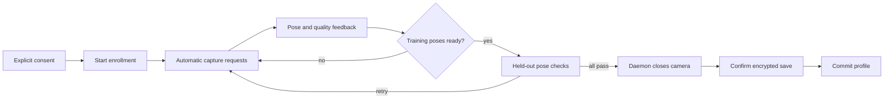

# GUI enrollment app

The optional Qt6 app is a same-user client of the daemon enrollment protocol.
It does not load models or open the camera itself.

## Current flow

The app provides:

- consent gating
- automatic capture requests every 300 ms
- center, left, right, up, and down guidance
- training/validation progress, accepted-sample count, held-out score, quality reason, luma, sharpness, and latency
- manual capture and progress refresh controls
- cancellation with sample erasure
- explicit confirmation before encrypted commit
- profile, manifest, and local-key deletion through Forget Me

The GUI does not receive or save camera frames. A live preview remains planned.

## Requirements

Build:

    ./scripts/build-gui.sh

Start a CPU-only enrollment daemon:

    ./build/daemon/face-unlockd \
      --camera 0 \
      --detector yunet \
      --detector-model models/face_detection_yunet_2022mar.onnx \
      --recognizer-model models/face_recognition_sface_2021dec.onnx \
      --daemon

Launch:

    ./build-gui/gui/face-unlock-enroll

The daemon must already be running. Missing YuNet, SFace, camera, or socket
requirements are shown as fail-closed recovery messages.

## Privacy and storage

Committed files are:

    ~/.local/share/face-unlock/template.enc
    ~/.local/share/face-unlock/enrollment.json
    ~/.local/share/face-unlock/template.key

Forget Me first cancels any active enrollment, then asks for confirmation before
removing all three files. It does not modify PAM, sudo, a display manager, or
lock-screen configuration.

The local key file is development key storage, not the final production key
design.

## Authentication safety

Refreshing GUI status does not send an `auth` request because auth requests
consume retry attempts. Authentication acceptance remains disabled regardless
of enrollment state.

## Tests

Run the headless enrollment response parser regression:

    ./build-gui/gui/face-unlock-enroll --self-test-enrollment-json

The GUI CI workflow builds the app and runs this test. Core daemon enrollment
behavior is covered separately by `enrollment_session`, `profile_storage`,
`enrollment_controller`, and `enrollment_protocol` CTests.

## Remaining work

- privacy-safe live preview design
- accessibility and real-camera usability testing
- production key management
- calibrated verification thresholds and liveness evaluation
