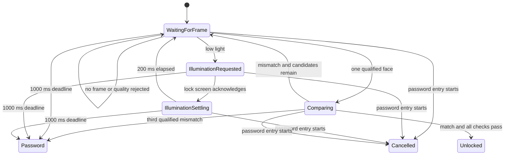

# Lock-screen authentication policy

This document defines the bounded authentication policy intended for a future
session-locker integration, with Hyprlock as the primary current target. The
policy controller and on-demand camera lease are implemented and tested.
Biometric matching, screen illumination, and unlock approval are not connected
yet.

## Policy

A lock-screen attempt has these defaults:

| Setting | Default |
|---|---:|
| Qualified face candidates | 3 maximum |
| Recognition window | 1000 ms |
| Illumination settle time | 200 ms |
| Low-light luma threshold | 50/255 |
| Password fallback | Always available |

A frame counts as a candidate only when the integration reports that a frame is
available, exactly one face is present, and all quality gates pass. Missing,
blurred, badly exposed, occluded, or ambiguous frames do not consume one of the
three candidates. The deadline still applies so camera or model failures cannot
hold the lock screen indefinitely.

## Low-light behavior

The daemon must never change display brightness or draw over the lock screen.
Only the active session-locker component can present a temporary neutral
illumination surface. Under Hyprland this requires native Hyprlock support. The
planned handshake is:

1. The daemon reports that the scene is below the low-light threshold.
2. The lock-screen component displays its illumination surface.
3. It acknowledges that the surface is visible.
4. The controller ignores frames during the 200 ms camera-exposure settling
   interval.
5. Authentication resumes with newly captured frames.
6. The surface is removed immediately after success, fallback, cancellation,
   or timeout.

This design does not require changing the user's saved brightness setting.
Screen illumination is an accessibility-sensitive feature and must have a
user-visible opt-out.

## Camera lifecycle requirement

The production integration must acquire the camera only for an active
lock-screen attempt and release it on every terminal path:

- explicit match success
- three qualified mismatches
- deadline reached
- password entry begins
- lock screen closes
- daemon, model, profile, or camera error

Daemon mode now starts with the camera closed. `lockscreen_start` creates a new
lease generation, clears every stale frame, opens the OpenCV/V4L2 source, and
reports cold-open and first-frame latency. Camera open and first-frame warm-up
each have a 1500 ms policy limit. The 1000 ms recognition window begins only
after the first usable frame, then the handle and in-memory frame are released.

`lockscreen_cancel` and `lockscreen_password_started` request immediate release.
The latter records `password_started` as the terminal reason. The release call
waits up to 500 ms and reports failure honestly if a blocking driver call has
not returned. OpenCV/V4L2 open and read calls are not themselves interruptible,
so stronger kernel-level cancellation bounds remain a production hardening
item.

## Protocol capability

A same-user client can query:

    ./scripts/test-socket-client.sh lockscreen_policy

The response exposes protocol version 1 and the policy constants. It reports:

    "implementation_status":"policy_ready_integration_pending"

This operation is read-only. It cannot start authentication, illuminate the
screen, or unlock a session.

Camera-lifecycle development operations are:

    ./scripts/test-socket-client.sh lockscreen_start
    ./scripts/test-socket-client.sh camera_status
    ./scripts/test-socket-client.sh lockscreen_password_started

They require same-user socket access and manage camera lifetime only. They do
not run matching or return an authentication decision. A privacy-safe local
measurement is available with:

    ./scripts/benchmark-camera-lease.sh --camera 0

## Security boundary

A future Hyprlock-native component may render status and illumination, but it
must not decide whether a face matched. The daemon owns biometric evaluation,
uses a bounded request, and returns an explicit decision. Password input must
cancel face processing immediately, and password or PIN fallback must remain
available.

The initial desktop target is an already-running Hyprland session protected by
Hyprlock. Hyprlock 0.9 invokes PAM after input submission, so PAM configuration
alone is not automatic face unlock. Display-manager or greetd login is a
separate integration with a different trust and process model.
