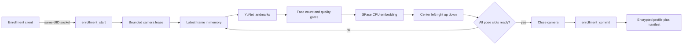

# Native enrollment protocol

The per-user daemon now owns enrollment state, camera lifetime, quality checks,
CPU embeddings, and encrypted profile commit. The Qt GUI is not connected to
this protocol yet.

This is an enrollment implementation, not an authentication approval path.
The normal `auth` operation still fails closed.

## Data flow

Raw frames and face crops remain in memory and are not written by this flow.
Only normalized pose centroids are serialized, and the profile payload is
encrypted before storage.

## Requirements

Start the daemon in camera mode with YuNet and SFace model paths:

    ./build/daemon/face-unlockd \
      --camera 0 \
      --detector yunet \
      --detector-model models/face_detection_yunet_2022mar.onnx \
      --recognizer-model models/face_recognition_sface_2021dec.onnx \
      --daemon

Enrollment start fails closed unless all of these are available:

- daemon camera manager
- YuNet five-landmark detector
- CPU SFace embedder
- same-user socket peer

The enrollment camera lease is bounded to 45 seconds. It closes immediately
when the pose profile becomes ready, on cancel, on commit, or on camera failure.

## Socket operations

- `enrollment_start` resets and starts a new bounded session
- `enrollment_capture` evaluates the current frame and accepts at most one sample
- `enrollment_status` reports state, progress, accepted count, and missing poses
- `enrollment_cancel` erases the in-memory builder and releases the camera
- `enrollment_commit` writes only when every pose slot is ready

Example:

    ./scripts/test-socket-client.sh enrollment_start
    ./scripts/test-socket-client.sh enrollment_capture
    ./scripts/test-socket-client.sh enrollment_status
    ./scripts/test-socket-client.sh enrollment_commit

A client should call `enrollment_capture` as new preview frames arrive. Rejected
frames return a specific reason such as `face_missing`, `multiple_faces`,
`low_light`, `blurred`, `face_too_small`, or `pose_unknown` without increasing
progress.

## Storage and failure behavior

The committed files are:

    ~/.local/share/face-unlock/template.enc
    ~/.local/share/face-unlock/template.key
    ~/.local/share/face-unlock/enrollment.json

Each file is written with mode 0600 using an atomic replacement. Ciphertext
tampering is rejected by libsodium authentication. A storage failure leaves the
session uncommitted, and authentication remains disabled.

The current key is a per-user local development key file. Production key
management, held-out profile validation, liveness, threshold calibration, and
GUI integration remain release blockers.

## Tests

CTest covers:

- pose-complete session transitions
- duplicate and incomplete sample rejection
- encrypted profile write, reload, permissions, key reuse, and tamper rejection
- camera release after readiness
- camera-failure session erasure
- cancellation followed by commit rejection
- socket-level fail-closed behavior with no biometric files written
