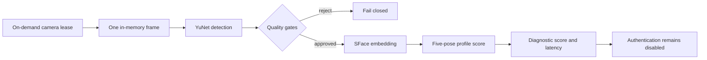

# Native verification diagnostics

The native diagnostic pipeline connects the CPU recognition components without
enabling authentication decisions.

## Quality boundary

A frame is rejected before embedding unless it has:

- exactly one detected face
- detection confidence of at least 0.80
- exactly five finite in-frame landmarks
- a face box fully inside the frame
- face area between 4% and 70% of the frame
- face-region mean luma between 35 and 225
- face-region Laplacian variance of at least 20

These defaults are engineering starting points, not calibrated security
thresholds. They require evaluation across consented devices, skin tones,
lighting, eyewear, mobility needs, and camera characteristics.

## Score-only pipeline

`DiagnosticVerificationPipeline` runs detection, quality evaluation, embedding,
and profile scoring. It returns per-stage timings and the best pose similarity.
It always returns `authentication_permitted=false`; there is deliberately no
acceptance threshold in this component.

The camera-free automated test uses injected detector and embedding functions
to cover successful scoring, quality rejection before embedding, and pipeline
errors.

## Live no-save benchmark

Build, download the pinned models, face the camera, and run:

    ./scripts/benchmark-native-verification.sh --camera 0 --iterations 20

The benchmark:

1. opens the camera through the bounded lease;
2. copies one frame into memory;
3. closes the camera before inference;
4. runs YuNet and the quality gates;
5. derives a temporary in-memory profile from that same frame;
6. measures repeated YuNet, SFace, and scoring latency;
7. writes no image, crop, embedding, or profile.

Because the temporary profile comes from the query frame, its similarity is not
an accuracy measurement. The command reports `benchmark_status: unavailable`
when no qualified face is present instead of fabricating latency or match data.
Use separate consented enrollment and held-out evaluation for false-accept and
false-reject calibration.
